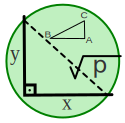

<p align="center">
    <a href="https://mathjslab.com/" target="_blank" rel="noopener"></a>
</p>

# [MathJSLab](https://mathjslab.com/) - [mathjslab.com](https://mathjslab.com/)

[](https://app.netlify.com/sites/mathjslab/deploys)
[](https://github.com/sergiolindau/mathjslab-calculator/blob/main/LICENSE)
[](https://doi.org/10.5281/zenodo.8396263)
[](https://dl.circleci.com/status-badge/redirect/gh/sergiolindau/mathjslab-calculator/tree/main)
[](https://github.com/sergiolindau/mathjslab-calculator)

> Um interpretador com sintaxe de linguagem tipo [MATLAB&reg;](https://www.mathworks.com/)/[Octave](https://www.gnu.org/software/octave/) escrito em [Typescript](https://www.typescriptlang.org/).

**ISBN 978-65-00-84828-1**

Este é um aplicativo de demonstração do [pacote npm](https://pt.wikipedia.org/wiki/Npm_(software)) [MathJSLab](https://www.npmjs.com/package/mathjslab). Veja esta demonstração na página do projeto em [mathjslab.com](https://mathjslab.com/).

Obtenha uma versão reduzida através de [CDN](https://pt.wikipedia.org/wiki/Rede_de_fornecimento_de_conte%C3%BAdo).
Para incorporar a calculadora [MathJSLab](https://www.npmjs.com/package/mathjslab) em uma página da web usando [CDN jsDelivr](https://www.jsdelivr.com/)
copie o seguinte código HTML:

```html
<head>
    ...
    <script defer src="https://cdn.jsdelivr.net/gh/sergiolindau/mathjslab-calculator/mathjslab-calculator.min.js"></script>
    ...
</head>

<body>
    ...
    <div id="mathjslab-calculator"></div>
    ...
</body>
```

Para que os exemplos e o comando `help` estejam disponíveis, é necessário
copiar os diretórios `example` e `help` para a raiz da página web.

Outra opção é configurar para usar diretamente do
[repositório](https://github.com/sergiolindau/mathjslab-calculator) via
[CDN jsDelivr](https://www.jsdelivr.com/) também, antes de carregar o script `mathjslab-calculator.min.js` usando:

```html
<head>
    ...
    <script>
        MathJSLabCalc = {
            exampleBaseUrl: "https://cdn.jsdelivr.net/gh/sergiolindau/mathjslab-calculator/",
            helpBaseUrl: "https://cdn.jsdelivr.net/gh/sergiolindau/mathjslab-calculator/",
        }
    </script>
    <script defer src="https://cdn.jsdelivr.net/gh/sergiolindau/mathjslab-calculator/mathjslab-calculator.min.js"></script>
    ...
</head>

<body>
    ...
    <div id="mathjslab-calculator"></div>
    ...
</body>
```

Esta aplicação de demontração também usa:

* [MathJax](https://www.mathjax.org/) para navegadores sem suporte [MathML](https://www.w3.org/Math/).
* [Marked](https://www.npmjs.com/package/marked) para formatar arquivos [Markdown](https://www.markdownguide.org/) como [HTML](https://developer.mozilla.org/pt-BR/docs/Web/HTML).
* [Plotly.js](https://plotly.com/javascript/) para gerar gráficos, histogramas e gráficos 3D.
* [Mermaid](https://mermaid.js.org/) para gerar grafos e diagramas.

## Contribuindo

Para contribuir com este projeto, consulte nossas
[diretrizes de contribuição](https://github.com/sergiolindau/mathjslab-calculator/blob/main/CONTRIBUTING.md).

Participe do bate-papo da comunidade:

[](https://matrix.to/#/#mathjslab:gitter.im?utm_source=badge&utm_medium=badge&utm_campaign=pr-badge&utm_content=badge)

## Compilação

Compile o `mathjslab-calculator` no modo de desenvolvimento usando:

```bash
npm run build:dev
```

Compile o `mathjslab-calculator` no modo de depuração usando:

```bash
npm run build:debug
```

Compile o `mathjslab-calculator` no modo de produção:

```bash
npm run build:prod
```

## Comunidade

Participe do bate-papo da comunidade:

[](https://matrix.to/#/#mathjslab:gitter.im?utm_source=badge&utm_medium=badge&utm_campaign=pr-badge&utm_content=badge)

## Licença

>MIT License
>
>Copyright &copy; 2016-2024 [Sergio Lindau](mailto:sergiolindau@gmail.com), [mathjslab.com](https://mathjslab.com/), ISBN 978-65-00-84828-1
>
>Permission is hereby granted, free of charge, to any person obtaining a copy
>of this software and associated documentation files (the "Software"), to deal
>in the Software without restriction, including without limitation the rights
>to use, copy, modify, merge, publish, distribute, sublicense, and/or sell
>copies of the Software, and to permit persons to whom the Software is
>furnished to do so, subject to the following conditions:
>
>The above copyright notice and this permission notice shall be included in all
>copies or substantial portions of the Software.
>
>THE SOFTWARE IS PROVIDED "AS IS", WITHOUT WARRANTY OF ANY KIND, EXPRESS OR
>IMPLIED, INCLUDING BUT NOT LIMITED TO THE WARRANTIES OF MERCHANTABILITY,
>FITNESS FOR A PARTICULAR PURPOSE AND NONINFRINGEMENT. IN NO EVENT SHALL THE
>AUTHORS OR COPYRIGHT HOLDERS BE LIABLE FOR ANY CLAIM, DAMAGES OR OTHER
>LIABILITY, WHETHER IN AN ACTION OF CONTRACT, TORT OR OTHERWISE, ARISING FROM,
>OUT OF OR IN CONNECTION WITH THE SOFTWARE OR THE USE OR OTHER DEALINGS IN THE
>SOFTWARE.
