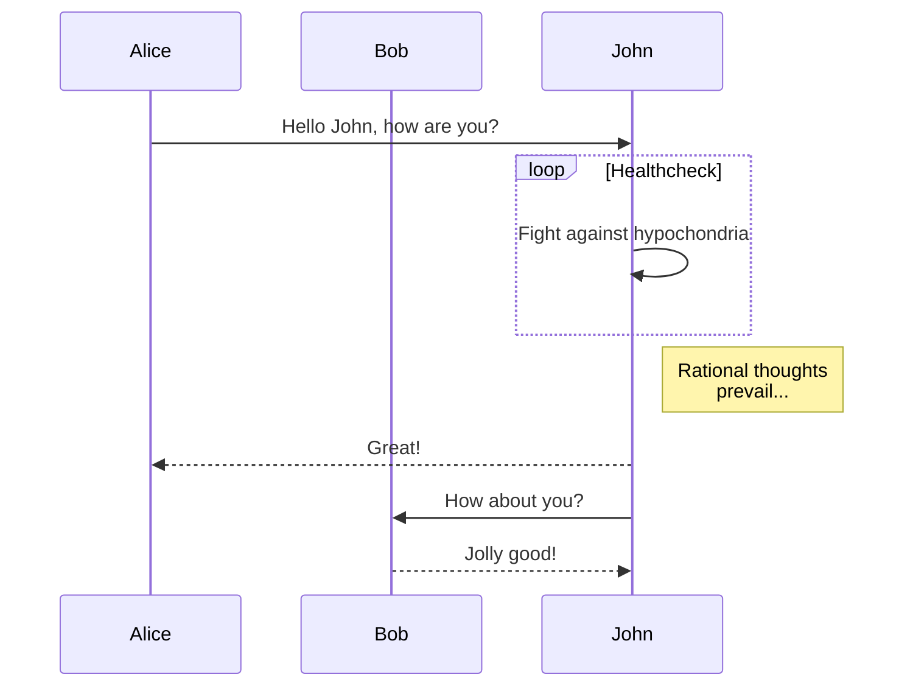
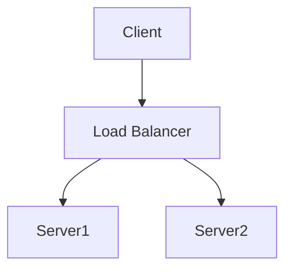
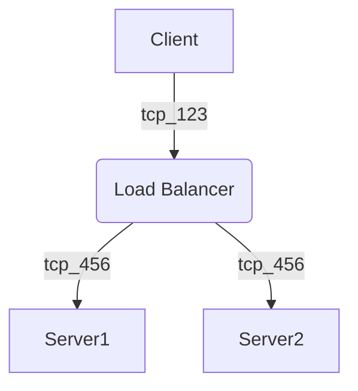

Testing!

```mermaid
sequenceDiagram
    participant Alice
    participant Bob
    Alice->>John: Hello John, how are you?
    loop Healthcheck
        John->>John: Fight against hypochondria
    end
    Note right of John: Rational thoughts <br/>prevail...
    John-->>Alice: Great!
    John->>Bob: How about you?
    Bob-->>John: Jolly good!
```

Test 2

```mermaid
graph TD
    A[Client] --> B[Load Balancer]
    B --> C[Server1]
    B --> D[Server2]
```

Another Graph

```mermaid
graph TD
    A[Client] -->|tcp_123| B
    B(Load Balancer)
    B -->|tcp_456| C[Server1]
    B -->|tcp_456| D[Server2]
```
